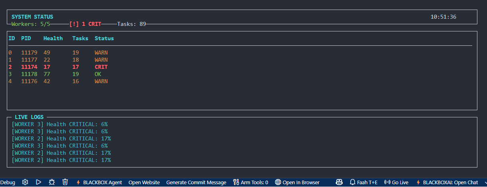
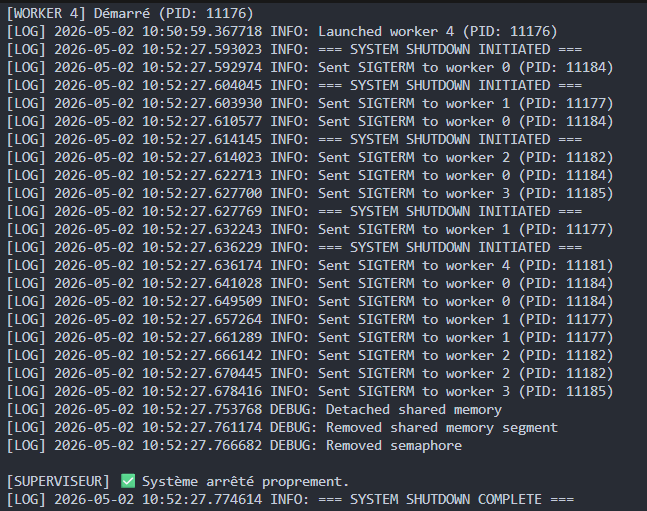
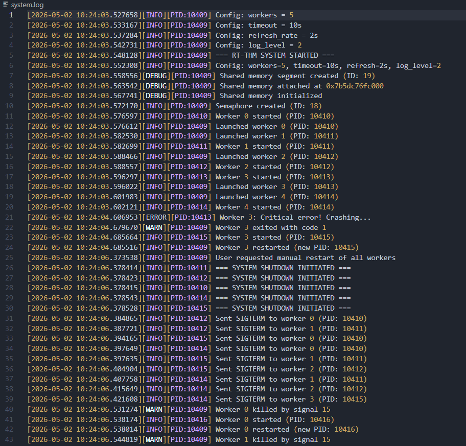
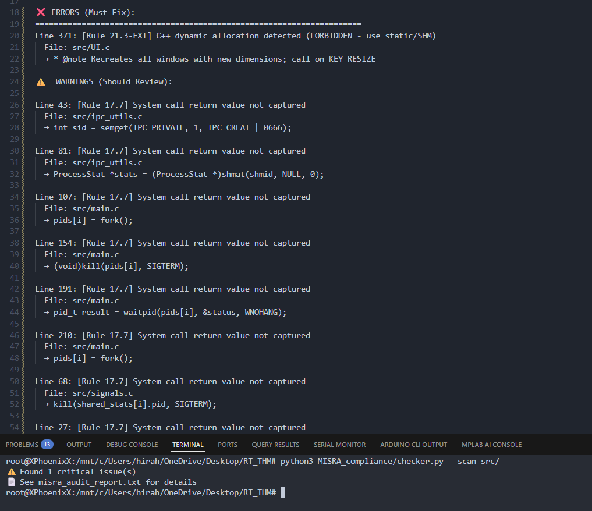
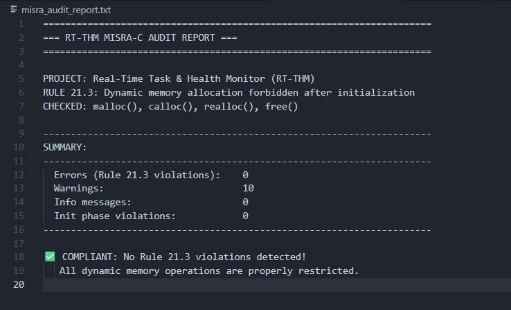

# RT-THM — Real-Time Task & Health Monitor

RT-THM is a **real-time process supervision project**. A **Supervisor (parent)** process spawns and monitors multiple **Worker (child)** processes that execute simulated tasks. Workers continuously publish their status using **POSIX shared memory**, and the supervisor reacts in near real time when a worker becomes unstable, hangs, or crashes.

This project also includes:
- **Ncurses UI dashboard** for live monitoring in the terminal
- **Logging** with timestamps
- A **MISRA-style audit checker** (Python) with an output report
- **Doxygen documentation** generation

---

## Project Dashboard

### Live ncurses dashboard


---

## Key Features

- **Multi-process management:** uses `fork()` to create worker processes.
- **IPC (Inter-Process Communication):**
  - **Shared Memory (POSIX)** for publishing worker statistics.
  - **Semaphores (POSIX)** to protect shared data and avoid race conditions.
- **Signals:** supervisor can signal workers (pause/resume strategy) using `SIGUSR1` / `SIGUSR2`.
- **Healing / Auto-restart:** supervisor detects dead workers (via `waitpid()`) and restarts them.
- **Real-time monitoring UI:** `ncurses` dashboard with live stats and log messages.
- **Static analysis support:** includes a Python checker for basic MISRA-like rules.
- **Doxygen documentation:** codebase is documented using Doxygen comments.

---

## Repository Structure

```text
.
├── include/                 # Public headers
│   ├── config.h
│   ├── ipc.h
│   ├── logger.h
│   ├── project.h
│   ├── signals.h
│   ├── UI.h
│   └── worker.h
├── src/                     # Implementation files
│   ├── config.c
│   ├── ipc_utils.c
│   ├── logger.c
│   ├── main.c
│   ├── signals.c
│   ├── UI.c
│   └── worker.c
├── Documentation/           # Reports / docs output (and Doxygen output)
│   └── images/              # README screenshots
├── config.txt               # Runtime configuration
├── MISRA_compliance/        # MISRA checker (project tooling)
│   └── checker.py
├── makefile
└── baseProj.c               # Legacy / base prototype (if still used)
```


---

## Requirements

### Build dependencies
- GCC (C99)
- ncurses development library

### Optional (documentation)
- Doxygen
- Graphviz (`dot`) for call graphs

---

## Quick Start (Build & Run)

### 1) Compile
```bash
make
```

Output executable:
```text
bin/rt-thm
```

### 2) Run
```bash
make run
```

Or:
```bash
./bin/rt-thm
```

---

## UI Controls (Ncurses)

Inside the dashboard:
- `q` : quit cleanly
- `r` : restart all workers (sends SIGTERM to all workers; supervisor restarts them)
- Terminal resize is handled (`KEY_RESIZE`)

> If ncurses fails to initialize, the program may fall back to console mode depending on the implementation.

### Terminal output


---

## Configuration

The project reads runtime parameters from:

- `config.txt`

Typical configurable fields (depending on your `config.c` implementation) may include:
- number of workers
- refresh rate
- timeout thresholds
- log verbosity

---

## Logging

Logs are written to a log file (commonly `system.log` if configured in code).  
Logged events typically include:
- startup/shutdown
- worker crash detection
- worker restart events
- timeouts and health alerts

### Log output example



---

## IPC Model (High Level)

Workers write their status into a shared array in POSIX shared memory, commonly using a structure like:

- PID
- health score
- tasks completed
- last update timestamp
- slow/hang detection flags
- command field (pause/resume)

The supervisor reads this data periodically to:
- display live metrics in the UI
- detect timeouts / instability
- restart crashed processes

To avoid race conditions, a POSIX semaphore is used as a **mutex** around shared memory access.

---

## Signals (Control Channel)

RT-THM uses signals for quick control commands:

- `SIGUSR1`: ask a worker to slow down / pause (depending on implementation)
- `SIGUSR2`: resume normal operation

---

## MISRA-Style Audit Checker

Run the checker:

```bash
make audit
```

Recommended checker invocation (if your checker supports directory scan):
```bash
python3 MISRA_compliance/checker.py --scan src/
```

The tool generates:
- `misra_audit_report.txt`

> The checker is intentionally simple (regex-based). Treat results as guidance and extend it for stricter compliance.


### MISRA checker — detection (before)


### MISRA checker — rectified (after)



---

## Generate Doxygen Documentation

### 1) Install tools (Ubuntu/Debian/WSL)
```bash
sudo apt update
sudo apt install doxygen graphviz
```

### 2) Generate docs
```bash
doxygen Doxyfile
```

Typical output:
```text
Documentation/doxygen/html/index.html
```

Open in browser (Linux/WSL GUI):
```bash
xdg-open Documentation/doxygen/html/index.html
```
Or use the powershell (windows):
```bash
start Documentation/doxygen/html/index.html
```

---

## Troubleshooting

### Ncurses build errors
Install ncurses dev package:
- Ubuntu/Debian: `sudo apt install libncurses-dev`
- Fedora: `sudo dnf install ncurses-devel`

### `powershell: not found` when running `make doc-open`
If you run `make` inside Linux/WSL, `powershell` may not exist. Prefer:
```bash
xdg-open Documentation/doxygen/html/index.html
```

Or use `wslview` if installed.

---

## Roadmap / Next Improvements

- Improve watchdog logic for hung workers (kill + restart policy)
- Add richer ncurses panels (global system stats, scrolling logs)
- Expand configuration format (INI/TOML/JSON)
- Expand MISRA checker + integrate with CI
- Add unit tests for config parser and IPC helpers

---

## License

Feel free to use it as you wish. It is a beginner friendly work. If you have any comments or want to help me improve something or simply for collaboration feel free to contact me .